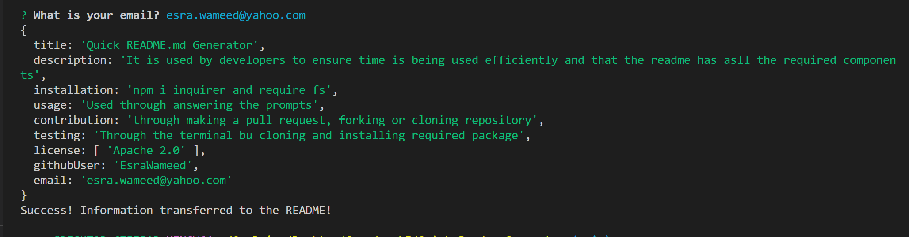

# Quick README.md Generator

  ## Licensing:
  
  ## Videos and Application Image
  - You can click on either the image or this link to access the video https://www.youtube.com/watch?v=3NE0NLoVIeg&ab_channel=EsraAl-Abduljabar
 

  ## Table of Contents 
  - [Description](#description)
  - [Installation](#installation)
  - [Usage](#usage)
  - [Contribution](#contribution)
  - [Testing](#testing)
  - [Additional Info](#additional-info)

  ## Description:
  This application utilizes node.js to establish an easy way to display prompts to users and create a professional README.md file customized with the user's responses. 
  Developers or coding enthusiasts can simply clone the code for this application, download the required packages, and use it on their device to generate README.md quick and easy.

  ## Installation:
  - Clone code to your local repository.
  - npm init -y
  - npm install inquirer@8.2.4

  ## Usage:
  - Answer the prompts provided.
  - Your custom README.md will be generated.

  ## License:
  MIT License

Copyright (c) 2022 Esra Al-Abduljabar

Permission is hereby granted, free of charge, to any person obtaining a copy
of this software and associated documentation files (the "Software"), to deal
in the Software without restriction, including without limitation the rights
to use, copy, modify, merge, publish, distribute, sublicense, and/or sell
copies of the Software, and to permit persons to whom the Software is
furnished to do so, subject to the following conditions:

The above copyright notice and this permission notice shall be included in all
copies or substantial portions of the Software.

THE SOFTWARE IS PROVIDED "AS IS", WITHOUT WARRANTY OF ANY KIND, EXPRESS OR
IMPLIED, INCLUDING BUT NOT LIMITED TO THE WARRANTIES OF MERCHANTABILITY,
FITNESS FOR A PARTICULAR PURPOSE AND NONINFRINGEMENT. IN NO EVENT SHALL THE
AUTHORS OR COPYRIGHT HOLDERS BE LIABLE FOR ANY CLAIM, DAMAGES OR OTHER
LIABILITY, WHETHER IN AN ACTION OF CONTRACT, TORT OR OTHERWISE, ARISING FROM,
OUT OF OR IN CONNECTION WITH THE SOFTWARE OR THE USE OR OTHER DEALINGS IN THE
SOFTWARE.

  ## Contribution:
  - Fork project to contribute.
  - Make a pull request.

  ## Testing:
  Through vs code open preview to view README.md

  ## Additional Info:
  - Github: [EsraWameed](https://github.com/esra)
  - Email: esra.wameed@yahoo.com
